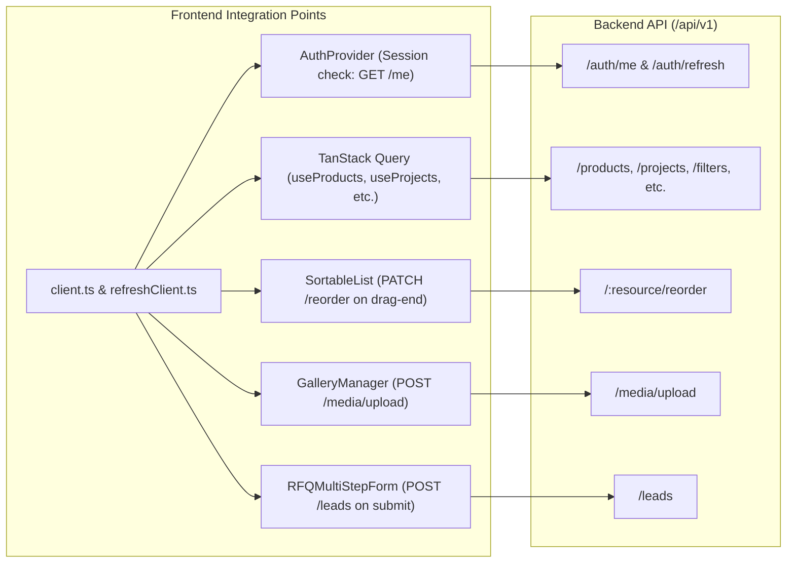

# Phase 03: Backend Foundation, MongoDB Schemas, REST Endpoints & Postman Suite

## 1. Executive Summary & Standards Alignment

This plan enforces the standards established in **[instructions.md](file:///home/hackunseen/Downloads/gmp%20vision/instructions.md)** (Full-Stack Project Blueprint v2.2) and the technical scope in **[docs/GMP_VISION_PRD.md](file:///home/hackunseen/Downloads/gmp%20vision/docs/GMP_VISION_PRD.md)**.

### Tech Stack & Language (Strict Verification):
* **Language:** **TypeScript** (`strict: true`, target ES2022/NodeNext, zero unverified `any`).
* **Runtime:** **Node.js** (Active LTS v18+; local environment verified v26.8.1).
* **Framework:** **Express** (`express@^5.2.1`).
* **Database & ODM:** **MongoDB Atlas** with **Mongoose** (`mongoose@^9.10.4`).
* **Validation:** **Zod** (`zod@^3.24.2`) for environment variables, request bodies, query strings, and route parameters.
* **Testing & API Contract:** **Postman** (`backend/postman/collection.json` and `backend/postman/environment.json`).
* **Security & Crypto:**
  * `helmet@^8.3.0` (CSP tailored for React SPA + Cloudinary).
  * `cors@^2.8.6` (explicit origin allowlist, credentials enabled).
  * `express-rate-limit@^8.7.0` (Global: 100 req/min, Auth: 10 req/min, Leads: 10 req/15min).
  * `express-mongo-sanitize@^2.2.0` (strips `$` and `.` operators).
  * `cookie-parser@^1.4.7` (HttpOnly, Secure, SameSite=Strict cookies).
  * `jsonwebtoken@^9.0.3` (15m access token, 7d refresh token).
  * `bcryptjs@^3.0.3` (cost factor 12).
  * `crypto.timingSafeEqual` (via `tokenCompare.ts`).
* **Storage:** **Cloudinary** (`cloudinary@^2.11.0`) + **Multer** (`multer@^1.4.5-lts.1`).
* **Email & Cron:** `nodemailer@^10.0.15` + `node-cron@^4.6.0`.

---

## 2. Implementation Waves

### Wave 1: Foundation, Security Pipeline & Health Probes (Days 1)
* **Task 1.1 — Package & Tooling Setup:**
  * Create `backend/package.json` with verified dependencies and script definitions (`dev`, `build`, `start`, `seed`).
  * Create `backend/tsconfig.json` with strict mode, `skipLibCheck: true`, `noImplicitAny: true`.
  * Create `backend/.gitignore` and root `.cursorignore` to prevent leaking `.env`, secrets, or `node_modules` into AI indexing or git.
  * Create `backend/.env.example` with commented placeholders.
* **Task 1.2 — Zod Configuration & Database Lifecycle:**
  * Implement `backend/src/config/env.ts` crashing immediately (`process.exit(1)`) on invalid config.
  * Implement `backend/src/config/db.ts` managing Mongoose lifecycle, reconnect events, and clean shutdown on `SIGINT`/`SIGTERM`.
* **Task 1.3 — Strict Express Pipeline (`src/app.ts`):**
  * Wire middleware stack in mandatory order:
    1. Helmet headers with tuned CSP
    2. CORS allowlist (`CORS_ORIGINS.split(',')` with `credentials: true`)
    3. Body parser `express.json({ limit: '10kb' })` & `express.urlencoded({ extended: true })`
    4. Cookie parser
    5. `express-mongo-sanitize`
    6. Morgan logger (development only)
    7. Rate limiters: Global (`/api`), Auth (`/api/v1/auth`), Leads (`/api/v1/leads`)
    8. Routes: `/api/v1`
    9. Health Probes: `GET /health` (liveness: 200 without DB call) & `GET /ready` (readiness: DB readyState check)
    10. Central RFC 7807 Error Handler (`src/middleware/errorHandler.ts`)
* **Task 1.4 — Server Entrypoint:**
  * Implement `backend/src/server.ts` binding DB connection, starting cron, and launching HTTP listener.

---

### Wave 2: Authentication, Security Primitives & Admin Management (Day 2)
* **Task 2.1 — Cryptographic & Security Utilities:**
  * `src/utils/tokenCompare.ts`: Timing-safe comparison wrapper using `crypto.timingSafeEqual`.
  * `src/utils/jwt.ts`: Sign/verify 15m access token and 7d refresh token.
  * `src/utils/ownershipCheck.ts`: `assertOwnership` helper returning `404 Not Found` (never 403).
* **Task 2.2 — Admin Mongoose Model & Schema:**
  * `src/modules/admins/admin.model.ts`: `email` (unique index), `passwordHash`, `role` (`admin` | `superadmin`), `failedLoginAttempts`, `lockUntil`, `refreshTokenHash`, `isActive`.
  * Account lockout: 5 consecutive failed attempts locks account for 15 minutes.
* **Task 2.3 — Middleware Guards:**
  * `requireAuth.ts`: Extracts Bearer token, verifies JWT, and attaches `req.user`.
  * `roleGuard.ts`: Enforces role hierarchy (`superadmin` vs `admin`).
* **Task 2.4 — Auth & Admin Routes:**
  * `POST /api/v1/auth/login`: Issues access token, stores bcrypt hashed refresh token in DB, sets `HttpOnly; Secure; SameSite=Strict` cookie.
  * `POST /api/v1/auth/refresh`: Reads cookie, checks DB hash, rotates refresh token cookie, returns new access token.
  * `POST /api/v1/auth/logout`: Revokes token hash in DB, clears cookie.
  * `GET /api/v1/auth/me`: Current admin profile.
  * `GET /api/v1/admins`, `POST /api/v1/admins`, `PATCH /api/v1/admins/:id`, `DELETE /api/v1/admins/:id` (Superadmin only).

---

### Wave 3: Core Domain Models & Dual Pagination (Day 3)
* **Task 3.1 — Dual Pagination Helper (`src/utils/pagination.ts`):**
  * Mode A: Offset pagination (`page`, `limit`, `total`, `totalPages`) for Admin CMS tables.
  * Mode B: Cursor pagination (`cursor`, `limit`, `nextCursor`, `hasMore`) for public grids.
* **Task 3.2 — Mongoose Schemas & Models (7 Domain Collections):**
  1. `divisions.model.ts`: 7 turnkey divisions with slugs, taglines, rich text, hero image, and order.
  2. `products.model.ts`: Cleanroom equipment, specification key-value array, gallery, division reference, order.
  3. `filters.model.ts`: Dedicated filtration catalog with micron ratings, frames, media construction, spec sheet URLs, order.
  4. `projects.model.ts`: Client case studies, photos, testimonials, division tags, order.
  5. `clients.model.ts`: Trust logo wall, sector tags, website link, order.
  6. `settings.model.ts`: Dynamic site metrics, hero headline, brochure PDF URL, WhatsApp number.
  7. `leads.model.ts`: RFQs, inquiries, and WhatsApp beacons with lifecycle status (`new` → `contacted` → `quoted` → `converted` → `closed`).
* **Task 3.3 — Database Indexes:**
  * Unique indexes: `email` on admins, `slug` on divisions/products.
  * Compound indexes: `{ isActive: 1, order: 1 }` on divisions, products, filters, projects, clients.
  * Text index: `{ name: 'text', description: 'text', tags: 'text' }` on products for search.

---

### Wave 4: Endpoints, Batch Reorder & Leads Ingestion (Day 4)
* **Task 4.1 — Public Catalog Read Endpoints:**
  * `GET /api/v1/divisions`, `GET /api/v1/divisions/:slug`
  * `GET /api/v1/products`, `GET /api/v1/products/:slug`
  * `GET /api/v1/filters`, `GET /api/v1/filters/:id`
  * `GET /api/v1/projects`, `GET /api/v1/projects/:id`
  * `GET /api/v1/clients`
  * `GET /api/v1/settings`
* **Task 4.2 — Admin CRUD & Batch Reordering:**
  * Full CRUD routes with Zod validation.
  * Batch reordering: `PATCH /api/v1/:resource/reorder` executing MongoDB `bulkWrite` for `@dnd-kit` drag-and-drop.
* **Task 4.3 — Leads & WhatsApp Tracking:**
  * `POST /api/v1/leads`: Ingests RFQ multi-step submissions, contact inquiries, and silent WhatsApp click beacons. Triggers Nodemailer alert.
  * `GET /api/v1/leads`: Admin list with filters & pagination.
  * `PATCH /api/v1/leads/:id/status`: Pipeline transitions.
  * `GET /api/v1/leads/export`: Streams CSV export.

---

### Wave 5: Cloudinary Media Upload & Database Seeding (Day 5)
* **Task 5.1 — Media Subsystem:**
  * `src/config/cloudinary.ts`: Cloudinary SDK credentials.
  * `src/middleware/upload.ts`: Multer buffer upload with strict MIME validation (JPEG, PNG, WebP ≤ 10MB; PDF ≤ 25MB).
  * `POST /api/v1/media/upload`: Streams buffer to Cloudinary `gmp-vision` folder, returns `{ url, publicId }`.
  * `DELETE /api/v1/media/:publicId`: Permanently deletes asset from Cloudinary.
* **Task 5.2 — Idempotent Database Seeder (`src/scripts/seed.ts`):**
  * Populates default Superadmin account from environment.
  * Seeds the 7 Turnkey Divisions with descriptions and icons from `WEBSITE_SERVICES_AND_CATALOG.md`.
  * Seeds initial filtration items, sample projects, and default site settings dictionary.

---

### Wave 6: Postman Test Suite & Verification (Day 6)
* **Task 6.1 — Postman Collection (`backend/postman/collection.json`):**
  * Structured folders for all 11 modules: `Health`, `Auth`, `Admins`, `Leads`, `Divisions`, `Products`, `Filters`, `Projects`, `Clients`, `Settings`, `Media`.
  * Root pre-request script checking `tokenExpiry` and auto-refreshing expired tokens.
  * Test assertions on every endpoint (HTTP status, `success: true`, RFC 7807 error format, dynamic `{{resourceId}}` extraction).
* **Task 6.2 — Postman Environment (`backend/postman/environment.json`):**
  * Variables: `baseUrl`, `accessToken`, `tokenExpiry`, `resourceId`, `testEmail`, `testPassword`.
* **Task 6.3 — Comprehensive Matrix Test:**
  * Happy path (200/201).
  * Validation error (400).
  * Unauthorized / Expired token (401).
  * Forbidden wrong role (403).
  * Not found (404).
  * Rate limit trigger (429).
  * Duplicate conflict (409).

---

## 3. Post-Backend: Frontend Integration Changes

Once the backend is operational, the frontend (`frontend/`) will be updated to transition from static mock data to the live API:

1. **Axios Client (`frontend/src/lib/api/`):**
   * Implement `client.ts` with `withCredentials: true`, attaching token from `tokenStore.ts`.
   * Implement single-flight refresh queue on 401 via `refreshClient.ts`.
2. **Authentication Flow (`frontend/src/auth/`):**
   * Wire `AdminLoginPage.tsx` to `POST /api/v1/auth/login`.
   * Update `AuthProvider.tsx` to verify session on initial load via `GET /api/v1/auth/me`.
3. **Data Fetching with TanStack Query:**
   * Replace static `data/*.ts` imports with React hooks:
     * `useProducts()` / `useProduct(slug)`
     * `useDivisions()` / `useDivision(slug)`
     * `useFilters()`
     * `useProjects()` (using cursor `useInfiniteQuery`)
     * `useClients()`
     * `useSettings()`
     * `useLeads()` (Admin CMS with offset pagination and status filter)
4. **Interactive Form Wiring:**
   * Wire `RFQMultiStepForm.tsx` to emit `POST /api/v1/leads` and clear session draft on success.
   * Wire WhatsApp floating CTA to call `initiateWhatsAppInquiry()` which pings `POST /api/v1/leads` beacon in background before opening WhatsApp Web.
5. **Admin CMS Drag-and-Drop Reordering:**
   * In `SortableList.tsx`, attach `onDragEnd` mutation to trigger `PATCH /api/v1/:resource/reorder`.
6. **Cloudinary Asset Upload in Admin:**
   * Wire `GalleryManager.tsx` and file input to `POST /api/v1/media/upload`.

---

## 4. Verification Criteria & Acceptance Gates

- [ ] `npm run build` in `backend/` compiles with 0 TypeScript errors under `strict: true`.
- [ ] `GET /health` returns `200 OK` `{ status: "ok" }` without database call.
- [ ] `GET /ready` returns `200 OK` `{ status: "ready" }` only when MongoDB connection state is `1`.
- [ ] Zod environment validation crashes process immediately if any required variable is missing.
- [ ] Postman test suite executes with 100% test passes across all 32 endpoints.
- [ ] Idempotent seed script (`npm run seed`) populates superadmin and the 7 divisions.
- [ ] Frontend compiles with 0 errors (`npm run build` in `frontend/`).
